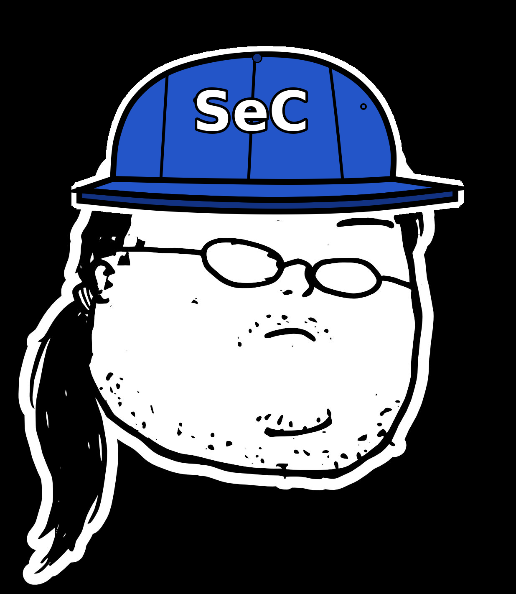

<p align="center">
  
</p>

<h1 align="center">ponytail-sec</h1>

<p align="center">
  <em>The smallest change that ruins an attacker's day.</em>
</p>

---

ponytail's security sibling. Instead of flooding you with findings, it hunts
the one dropped capability, the one `readOnlyRootFilesystem: true`, the one
narrowed RBAC verb that kills a link in the attack chain. Butterfly effect
for defense: tiny diffs, outsized reduction in attacker leverage.

Same dependency lens as [ponytail](https://github.com/DietrichGebert/ponytail):
"Do I actually need this dep?" Fewer dependencies = smaller supply-chain
attack surface. Prefer remove over keep.

## Before / After

```yaml
# before — process runs as root, can write anywhere, trivial container escape
containers:
  - name: controller
    image: ghcr.io/example/controller:latest
```

```yaml
# after — 4 lines close the container-escape path
containers:
  - name: controller
    image: ghcr.io/example/controller:v1.2.3
    securityContext:
      runAsNonRoot: true
      readOnlyRootFilesystem: true
      capabilities:
        drop: ["ALL"]
```

One diff. One closed kill-chain link.

## Install

### Claude Code

Latest:
```
/plugin marketplace add andypitcher/ponytail-sec
/plugin install ponytail-sec@ponytail-sec
```

Pinned to a version:
```
/plugin marketplace add andypitcher/ponytail-sec@0.2.1
/plugin install ponytail-sec@ponytail-sec
```

## How it works

Three passes, in order:

```
1. Code review    Does this code need to exist at all?
                  Apply the ponytail lens first: YAGNI, stdlib first,
                  remove over refactor. Fewer lines = smaller attack surface.

2. Dependency     Does this dependency need to exist?
                  Every dep is supply-chain surface. For each one, ask:
                    a. Does stdlib or the platform already do this?  → remove the dep
                    b. Is it maintained by a single person, or has a
                       low OpenSSF Scorecard / no recent commits?    → fork or vendor
                    c. Does it bring more than it costs?             → keep, pin immutably
                  Prefer: remove > stdlib > vendor > immutable pin > keep floating.

3. Hardening      Four stages, top-to-bottom. Stage 1 break voids all below.
                  Rank within each stage by attacker leverage removed ÷ lines changed.
                  The smallest change that ruins an attacker's day wins.
                  Default output: up to 3 material findings total; no padding. More only on request.
```

Report only what breaks an attack path. Security theater goes unreported.

## Kill-chain stages

```
Stage 1 · Trust      Can the attacker forge or bypass identity?
                     · Trust-anchor material (JWKS, CA certs, OAuth) over verified TLS?
                     · Token validation complete — issuer, audience, algorithm, scope, expiry?
                     · Auth bypass modes guarded to non-production?

Stage 2 · Authz      If they're in, can they escalate?
                     · RBAC narrowed to minimum verbs/resources?
                     · Claims validated server-side, not just checked for presence?
                     · Write paths gated from read paths?

Stage 3 · Exec       If they execute, can they escape?
                     · Container: non-root, readOnlyRootFilesystem, capabilities.drop: [ALL]
                     · Supply chain: base images pinned to digest, deps verified
                     · Injection: no shell=True, no unsafe deserialization

Stage 4 · Data       If they're in, what do they reach?
                     · Secrets hardcoded, in env, in manifests?
                     · Unnecessary ports, debug endpoints?
                     · TLS on all in-transit paths?
```

## Safe by design

Lists findings, fixes nothing. The agent reads the skill and reports; it never
applies changes, runs untrusted code, or touches production.

## Usage

**`/ponytail-sec`** — The security engineer sitting next to you while you
code. Scopes to your current diff. Three passes, up to 3 material findings,
lean output. Ends with Ship or Ship blocked — nothing in between. Invoke
directly or say "harden this", "security review", "is this dep safe",
"reduce attack surface".

**`/ponytail-sec-audit`** — Full project scan. All findings, CVSS 4.0 scored,
with blast-radius narrative and a frank "if I were you" prioritisation that
may differ from the score order. Invoke directly or say "full security audit",
"audit the project", "security scan".

## Relation

Part of the [ponytail](https://github.com/DietrichGebert/ponytail) skill
family. Same voice, security lens.

MIT license.
